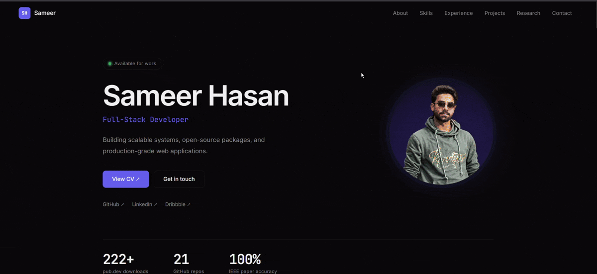

<div align="center">

# Sameer Hasan

### Full-Stack Developer • UI/UX Designer • Researcher

Building scalable web applications, beautiful user experiences, and AI-powered solutions.

[🌐 Live Portfolio](https://your-portfolio.vercel.app)
•
[💼 LinkedIn](https://linkedin.com/in/sameer-h-607594205)
•
[📧 Email](mailto:sameerhasanwork1@gmail.com)
•
[📄 Resume](https://your-resume-link)

</div>

---

## ✨ Portfolio Preview



<div align="center">

### 🚀 Live Website

👉 **https://your-portfolio.vercel.app**

</div>

---

## 🎯 About

I'm **Sameer Hasan**, a Full-Stack Developer and UI/UX Designer passionate about creating modern digital experiences.

- 🎓 Computer Science Graduate
- 📄 IEEE Published Research Author
- 💻 React, Next.js & TypeScript Developer
- 🎨 UI/UX Designer with Figma & Adobe Experience
- 🚀 Building scalable web applications

---

## 🏆 Highlights

### IEEE Research Publication

**Accurate Gesture Recognition in Indian Sign Language Using Deep Learning**

- Published in IEEE
- Achieved 100% accuracy using MobileNetV2
- Presented at International Conference

---

## 🛠 Tech Stack

### Frontend


### Backend & CMS


### Deployment


---

## 📸 Features

### Modern Portfolio Experience

- Smooth page animations
- CMS powered content management
- Responsive design
- Dark mode interface
- Interactive project showcase
- Research publication section
- Experience timeline
- Contact integration

---

## 🧩 Architecture

```text
Sanity CMS
      │
      ▼
 Next.js 15
      │
      ▼
 Tailwind CSS
      │
      ▼
 Framer Motion
      │
      ▼
    Vercel
```

---

## 📂 Featured Projects

### 🔹 Sign Language Recognition

Deep Learning based Indian Sign Language Recognition System.

**Tech:** Python, TensorFlow, MobileNetV2

---

### 🔹 Live Polling System

Real-time polling platform using Socket.io.

**Tech:** React, Redux, Express, Socket.io

---

### 🔹 Management Dashboard

Modern analytics dashboard with advanced UI.

**Tech:** React, TypeScript, TailwindCSS

---

## 📈 GitHub Stats

<div align="center">


</div>

---

## 🤝 Connect With Me

<div align="center">

[LinkedIn](https://linkedin.com/in/sameer-h-607594205) •
[GitHub](https://github.com/Sameerhasan1) •
[Dribbble](https://dribbble.com/mail-kairu-design) •
[Email](mailto:sameerhasanwork1@gmail.com)

</div>

---

<div align="center">

### ⭐ If you like this portfolio, consider giving it a star.

Built with ❤️ by Sameer Hasan

</div>